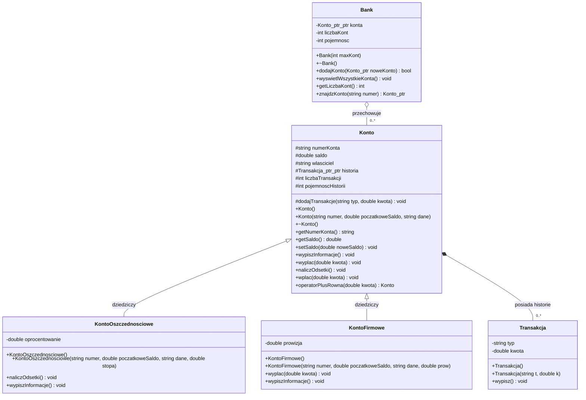

# Schemat klas UML

```mermaid
classDiagram
    class Bank {
        -Konto_ptr_ptr konta
        -int liczbaKont
        -int pojemnosc
        +Bank(int maxKont)
        +~Bank()
        +dodajKonto(Konto_ptr noweKonto) bool
        +wyswietlWszystkieKonta() void
        +getLiczbaKont() int
        +znajdzKonto(string numer) Konto_ptr
    }
    class Konto {
        #string numerKonta
        #double saldo
        #string wlasciciel
        #Transakcja_ptr_ptr historia
        #int liczbaTransakcji
        #int pojemnoscHistorii
        #dodajTransakcje(string typ, double kwota) void
        +Konto()
        +Konto(string numer, double poczatkoweSaldo, string dane)
        +~Konto()
        +getNumerKonta() string
        +getSaldo() double
        +setSaldo(double noweSaldo) void
        +wypiszInformacje() void
        +wyplac(double kwota) void
        +naliczOdsetki() void
        +wplac(double kwota) void
        +operatorPlusRowna(double kwota) Konto
    }

    class KontoOszczednosciowe {
        -double oprocentowanie
        +KontoOszczednosciowe()
        +KontoOszczednosciowe(string numer, double poczatkoweSaldo, string dane, double stopa)
        +naliczOdsetki() void
        +wypiszInformacje() void
    }

    class KontoFirmowe {
        -double prowizja
        +KontoFirmowe()
        +KontoFirmowe(string numer, double poczatkoweSaldo, string dane, double prow)
        +wyplac(double kwota) void
        +wypiszInformacje() void
    }

    class Transakcja {
        -string typ
        -double kwota
        +Transakcja()
        +Transakcja(string t, double k)
        +wypisz() void
    }
    Bank o-- "0..*" Konto : przechowuje
    Konto <|-- KontoOszczednosciowe : dziedziczy
    Konto <|-- KontoFirmowe : dziedziczy
    Konto *-- "0..*" Transakcja : posiada historie
```